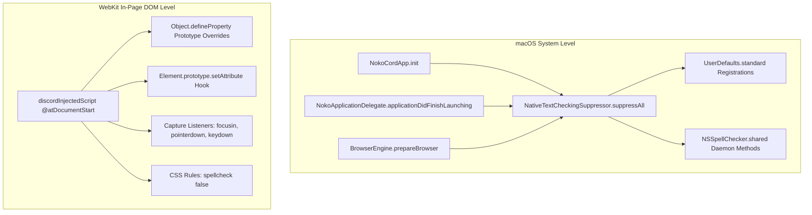

# NokoCord (Chiaki Edition) — In-Page Runtime & DOM Engine

This document details the in-page JavaScript runtime, Discord DOM injection lifecycle, style customization, Discord Flux store hooking, and macOS text checking eradication in **NokoCord (Chiaki Edition)**.

---

## 1. Script Injection Architecture (`discordInjectedScript`)

The primary in-page runtime is declared as a static multiline JavaScript script in `NokoCord/Services/TanRuntime.swift`:

```swift
static let discordInjectedScript: String = #""" ... """#
```

### Injection Timing & Lifecycle
* **Injection Point**: `WKUserScriptInjectionTime.atDocumentStart`, for main frame only (`forMainFrameOnly: true`).
* **Why `.atDocumentStart` is Critical**:
  Running at document start guarantees our script executes **before** Discord's webpack bundles, React components, and Slate editor mount. This allows us to install prototype overrides and monkeypatch `Element.prototype.setAttribute` before any Discord DOM nodes are constructed.
* **The `onReady()` Helper Pattern**:
  Because `.atDocumentStart` runs before `document.head` and `document.documentElement` exist in the DOM tree, any direct DOM element creation (such as injecting `<style>`) must be guarded:
  ```javascript
  const onReady = (fn) => {
    if (document.readyState === 'interactive' || document.readyState === 'complete') {
      fn();
    } else {
      document.addEventListener('DOMContentLoaded', fn, { once: true });
    }
  };
  ```
  Attempting `document.head.appendChild()` without this check will crash the script execution silently.

---

## 2. Complete Autocorrect, Autocomplete & Prediction Eradication

macOS text checking and predictive typing frequently interfere with Discord usage (replacing gaming slang, altering CLI commands `--help` into em-dashes `—`, replacing quotes `'` with curly quotes `’` which breaks markdown codeblocks, and showing inline predictive ghost text).

NokoCord neutralizes all automatic text transformations across **both native macOS AppKit and the WebKit DOM**.



### 1. Native macOS Layer (`NativeTextCheckingSuppressor`)
Located in `NokoCord/Services/BrowserEngine.swift`:

```swift
@MainActor
enum NativeTextCheckingSuppressor {
    static func suppressAll() {
        let textCheckingDefaults: [String: Any] = [
            "NSAutomaticSpellingCorrectionEnabled": false,
            "NSAutomaticTextReplacementEnabled": false,
            "NSAutomaticQuoteSubstitutionEnabled": false,
            "NSAutomaticDashSubstitutionEnabled": false,
            "NSAutomaticCapitalizationEnabled": false,
            "NSAutomaticPeriodSubstitutionEnabled": false,
            "NSAutomaticInlinePredictionEnabled": false,
            "NSAutomaticTextCompletionEnabled": false,
            "WebAutomaticTextCompletionEnabled": false,
            "WebInlinePredictionEnabled": false,
            "WebContinuousSpellCheckingEnabled": false,
            "WebGrammarCheckingEnabled": false,
            "WebAutomaticSpellingCorrectionEnabled": false
        ]
        UserDefaults.standard.register(defaults: textCheckingDefaults)
        for (key, val) in textCheckingDefaults {
            UserDefaults.standard.set(val, forKey: key)
        }
        let checker = NSSpellChecker.shared
        let selectors = [
            "setAutomaticInlinePredictionEnabled:",
            "setAutomaticInlineCompletionEnabled:",
            "setAutomaticTextCompletionEnabled:",
            "setAutomaticSpellingCorrectionEnabled:",
            "setAutomaticTextReplacementEnabled:",
            "setAutomaticQuoteSubstitutionEnabled:",
            "setAutomaticDashSubstitutionEnabled:",
            "setAutomaticCapitalizationEnabled:",
            "setAutomaticPeriodSubstitutionEnabled:"
        ]
        for selName in selectors {
            let sel = NSSelectorFromString(selName)
            if checker.responds(to: sel) {
                checker.perform(sel, with: false as NSNumber)
            }
        }
    }
}
```

#### Why Calling `NSSpellChecker.shared` Daemon Methods is Essential
In macOS Sonoma (14+) and Sequoia (15+), **inline predictive text** (grey ghost text) and automatic completions are controlled by private internal state inside `NSSpellChecker`. Registering `UserDefaults` keys alone is insufficient once the system spellchecker daemon is active. Directly invoking `setAutomaticInlinePredictionEnabled:` and `setAutomaticInlineCompletionEnabled:` forces the system daemon to disable predictions for the current process.

### 2. DOM-Level Prototype & Event Locks
Located in `NokoCord/Services/TanRuntime.swift`:

1. **Prototype Property Locks**:
   `autocomplete`, `spellcheck`, `autocorrect`, and `autocapitalize` are locked on `HTMLElement.prototype`, `HTMLInputElement.prototype`, and `HTMLTextAreaElement.prototype`:
   ```javascript
   const targets = [
     HTMLElement.prototype,
     HTMLInputElement.prototype,
     HTMLTextAreaElement.prototype
   ];
   targets.forEach((proto) => {
     ['spellcheck', 'autocorrect', 'autocapitalize', 'autocomplete'].forEach((prop) => {
       try {
         Object.defineProperty(proto, prop, {
           get() { return prop === 'spellcheck' ? false : 'off'; },
           set(_) {},
           configurable: true
         });
       } catch (_) {}
     });
   });
   ```
2. **`Element.prototype.setAttribute` Interception**:
   Whenever Discord or React calls `.setAttribute('autocomplete', ...)` or `.setAttribute('spellcheck', 'true')`, the wrapper forces `'off'` and `'false'`.
3. **Capture Phase Event Interception**:
   `focusin`, `pointerdown`, and `keydown` events dynamically enforce attributes on any targeted editable element (`isContentEditable`, `textarea`, `input`, `[role="textbox"]`).
4. **Grammar Extensions Neutralization**:
   Sets `data-gramm="false"` and `data-enable-grammarly="false"` to prevent third-party spellcheck browser extensions from injecting DOM overlays.

---

## 3. Discord Flux Store & Webpack Hooking

To perform clean memory management and navigation tracking without fragile DOM parsing, NokoCord taps into Discord's internal Webpack bundle.

### Safe Webpack Extraction Pattern
```javascript
let discordMessageStore = null;
let discordSelectedChannelStore = null;
let discordDispatcher = null;

const getDiscordStores = () => {
  if (discordMessageStore && discordSelectedChannelStore && discordDispatcher) return true;
  try {
    const chunk = window.webpackChunkdiscord_app;
    if (!chunk || typeof chunk.push !== 'function') return false;
    let req;
    chunk.push([[Symbol()], {}, (r) => { req = r; }]);
    if (!req || !req.c) return false;
    const modules = Object.values(req.c);
    for (let i = 0; i < modules.length; i++) {
      const exp = modules[i]?.exports;
      if (!exp) continue;
      const candidates = [exp, exp.default, exp.Z, exp.ZP].filter(Boolean);
      for (const c of candidates) {
        if (typeof c === 'object' && c !== null) {
          if (typeof c.getName === 'function') {
            const name = c.getName();
            if (name === 'MessageStore') discordMessageStore = c;
            else if (name === 'SelectedChannelStore') discordSelectedChannelStore = c;
          }
          if (c.dispatch && c.subscribe && !discordDispatcher) {
            discordDispatcher = c;
          }
        }
      }
      if (discordMessageStore && discordSelectedChannelStore && discordDispatcher) break;
    }
    return Boolean(discordMessageStore);
  } catch (_) {
    return false;
  }
};
```

### Subscribing to Discord's Dispatcher
Instead of polling the DOM for channel changes, NokoCord hooks Discord's internal Flux Dispatcher:
```javascript
discordDispatcher.subscribe('CHANNEL_SELECT', () => {
  setTimeout(onChannelNavigated, 80);
});
```
This triggers instant memory pruning, offscreen media eviction, and Swift location synchronization immediately upon channel selection.

---

## 4. Native Styling & macOS Parity

NokoCord injects a custom `<style id="nokocord-native-overrides">` element that transforms the Discord web app into a native macOS desktop interface.

### Key CSS Rules
1. **Traffic Light Safe Area**:
   Pads the server icon list down 32px to clear macOS native window controls:
   ```css
   nav[class*="guilds_"],
   div[class*="guilds_"][class*="wrapper_"],
   ul[class*="tree_"] {
     padding-top: 32px !important;
   }
   ```
2. **Native Window Dragging**:
   Enables window dragging across the Discord channel header while preserving clickability on search bars, buttons, and titles:
   ```css
   [class*="subtitleContainer_"],
   [class*="headerBar_"],
   section[class*="title_"] {
     -webkit-app-region: drag !important;
   }
   [class*="toolbar_"],
   [class*="searchBar_"],
   [class*="children_"],
   button, a, input {
     -webkit-app-region: no-drag !important;
   }
   ```
3. **Eradication of Download Nags**:
   Permanently hides banners prompting the user to download the Discord desktop client:
   ```css
   [class*="downloadApps_"],
   [class*="desktopAppBanner_"],
   [class*="webDownloadAppBanner_"],
   a[href*="/download"] {
     display: none !important;
   }
   ```
4. **macOS Overlay Scrollbars**:
   Thin, unobtrusive 8px rounded overlay scrollbars matching macOS system styling.

---

## 5. Native Lightbox Interception

Discord's native React image modal allocates significant memory (mounting full-screen backdrop containers, loading multiple thumbnail variants, and binding complex drag listeners).

NokoCord intercepts clicks on chat media at the capture phase:
```javascript
document.addEventListener('click', (e) => {
  const mediaContainer = e.target.closest('div[class*="imageWrapper_"], div[class*="imageContent_"], a[class*="originalLink_"], div[class*="video_"]');
  // ... extracts original media URL ...
  if (mediaUrl) {
    e.preventDefault();
    e.stopPropagation();
    window.webkit?.messageHandlers?.nokoCordApp?.postMessage({
      action: 'openMedia',
      url: mediaUrl,
      isVideo: isVideo
    });
  }
}, true);
```
This bypasses Discord's React modal entirely and opens `NativeMediaViewer.swift` in native AppKit/SwiftUI.
