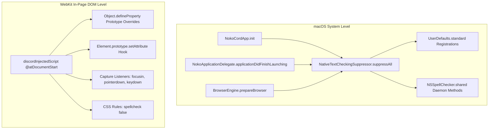

# NokoCord (Chiaki Edition) — In-Page Runtime & DOM Engine

This document details the in-page JavaScript runtime, Discord DOM injection lifecycle, style customization, Discord Flux store hooking, and macOS text checking eradication in **NokoCord (Chiaki Edition)**.

---

## 1. Script Injection Architecture (`discordInjectedScript`)

The primary in-page runtime is declared as a static multiline JavaScript script in `NokoCord/Services/TanRuntime.swift`:

```swift
static let discordInjectedScript: String = #""" ... """#
```

### Injection Timing & Lifecycle
* **Injection Point**: `WKUserScriptInjectionTime.atDocumentStart`, for main frame only (`forMainFrameOnly: true`).
* **Why `.atDocumentStart` is Critical**:
  Running at document start guarantees our script executes **before** Discord's webpack bundles, React components, and Slate editor mount. This allows us to install prototype overrides and monkeypatch `Element.prototype.setAttribute` before any Discord DOM nodes are constructed.
* **The `onReady()` Helper Pattern**:
  Because `.atDocumentStart` runs before `document.head` and `document.documentElement` exist in the DOM tree, any direct DOM element creation (such as injecting `<style>`) must be guarded:
  ```javascript
  const onReady = (fn) => {
    if (document.readyState === 'interactive' || document.readyState === 'complete') {
      fn();
    } else {
      document.addEventListener('DOMContentLoaded', fn, { once: true });
    }
  };
  ```
  Attempting `document.head.appendChild()` without this check will crash the script execution silently.

---

## 2. Complete Autocorrect, Autocomplete & Prediction Eradication

macOS text checking and predictive typing frequently interfere with Discord usage (replacing gaming slang, altering CLI commands `--help` into em-dashes `—`, replacing quotes `'` with curly quotes `’` which breaks markdown codeblocks, and showing inline predictive ghost text).

NokoCord neutralizes all automatic text transformations across **both native macOS AppKit and the WebKit DOM**.


```mermaid
graph TD
    subgraph macOS System Level
        A[NokoCordApp.init] --> D[NativeTextCheckingSuppressor.suppressAll]
        B[NokoApplicationDelegate.applicationDidFinishLaunching] --> D
        C[BrowserEngine.prepareBrowser] --> D
        D --> E[UserDefaults.standard Registrations]
        D --> F[NSSpellChecker.shared Daemon Methods]
    end

    subgraph WebKit In-Page DOM Level
        G[discordInjectedScript @atDocumentStart] --> H[Object.defineProperty Prototype Overrides]
        G --> I[Element.prototype.setAttribute Hook]
        G --> J[Capture Listeners: focusin, pointerdown, keydown]
        G --> K[CSS Rules: spellcheck false]
    end
```

### 1. Native macOS Layer (`NativeTextCheckingSuppressor`)
Located in `NokoCord/Services/BrowserEngine.swift`:

```swift
@MainActor
enum NativeTextCheckingSuppressor {
    static func suppressAll() {
        let textCheckingDefaults: [String: Any] = [
            "NSAutomaticSpellingCorrectionEnabled": false,
            "NSAutomaticTextReplacementEnabled": false,
            "NSAutomaticQuoteSubstitutionEnabled": false,
            "NSAutomaticDashSubstitutionEnabled": false,
            "NSAutomaticCapitalizationEnabled": false,
            "NSAutomaticPeriodSubstitutionEnabled": false,
            "NSAutomaticInlinePredictionEnabled": false,
            "NSAutomaticTextCompletionEnabled": false,
            "WebAutomaticTextCompletionEnabled": false,
            "WebInlinePredictionEnabled": false,
            "WebContinuousSpellCheckingEnabled": false,
            "WebGrammarCheckingEnabled": false,
            "WebAutomaticSpellingCorrectionEnabled": false
        ]
        UserDefaults.standard.register(defaults: textCheckingDefaults)
        for (key, val) in textCheckingDefaults {
            UserDefaults.standard.set(val, forKey: key)
        }
        let checker = NSSpellChecker.shared
        let selectors = [
            "setAutomaticInlinePredictionEnabled:",
            "setAutomaticInlineCompletionEnabled:",
            "setAutomaticTextCompletionEnabled:",
            "setAutomaticSpellingCorrectionEnabled:",
            "setAutomaticTextReplacementEnabled:",
            "setAutomaticQuoteSubstitutionEnabled:",
            "setAutomaticDashSubstitutionEnabled:",
            "setAutomaticCapitalizationEnabled:",
            "setAutomaticPeriodSubstitutionEnabled:"
        ]
        for selName in selectors {
            let sel = NSSelectorFromString(selName)
            if checker.responds(to: sel) {
                checker.perform(sel, with: false as NSNumber)
            }
        }
    }
}
```

#### Why Calling `NSSpellChecker.shared` Daemon Methods is Essential
In macOS Sonoma (14+) and Sequoia (15+), **inline predictive text** (grey ghost text) and automatic completions are controlled by private internal state inside `NSSpellChecker`. Registering `UserDefaults` keys alone is insufficient once the system spellchecker daemon is active. Directly invoking `setAutomaticInlinePredictionEnabled:` and `setAutomaticInlineCompletionEnabled:` forces the system daemon to disable predictions for the current process.

### 2. Editor Attributes and Navigation Hooks

What the runtime actually does to the page, as opposed to what it used to be
documented as doing:

### Editor attribute suppression
A capture-phase `focusin` listener sets `autocomplete`, `spellcheck`,
`autocorrect` and `autocapitalize` on whichever editor received focus. There
are no prototype overrides, no `setAttribute` hook and no Grammarly-specific
attribute: on current macOS the ghost text is killed by the `NSSpellChecker`
calls in the app, not by the page.

### Navigation detection
Discord's client is a single-page app, so navigation is detected by wrapping
`history.pushState` and `history.replaceState` and listening for `popstate` in
the injected script, then notifying the app after a short delay so the app sees
the settled DOM rather than a half-rendered channel.

Earlier revisions of this document described subscribing to Discord's Flux
stores (`MessageStore`, `SelectedChannelStore`, a `discordDispatcher` and a
`CHANNEL_SELECT` action). None of that exists in the codebase, and nothing
should be written against it.

### Local activity dispatch
The one place the page's webpack runtime is touched is Rich Presence: the app
resolves the dispatcher that the client's own `LocalActivityStore` registered
and confirms the activity landed in that store. See
[NATIVE_FEATURES.md](NATIVE_FEATURES.md) for the payload rules.

## 3. Page Runtime Touch Points

NokoCord keeps its contact with Discord's own JavaScript deliberately small, and
documents each place it happens.

### Navigation
Discord is a single-page app. The injected script wraps
`history.pushState`/`history.replaceState` and listens for `popstate`, then
notifies the app after a short delay so it sees a settled DOM. Earlier revisions
of this document described subscribing to Flux stores (`MessageStore`,
`SelectedChannelStore`, a `discordDispatcher` and a `CHANNEL_SELECT` action) —
none of that exists in the codebase, and nothing should be written against it.

### Rich Presence
The app resolves the dispatcher that the client's own `LocalActivityStore`
registered, dispatches the activity and confirms it appeared in that store. This
is the only code that walks `window.webpackChunkdiscord_app`. See
[NATIVE_FEATURES.md](NATIVE_FEATURES.md) for the payload rules and
[TANS.md](TANS.md) for the Tan contract that switches the feature on.

### Media interception
Clicking media in Discord is intercepted and opened in the native lightbox
(`Views/NativeMediaLightboxView.swift`), which also owns "save to Downloads" and
"copy URL". No React internals are patched to do this.

## 4. Native Styling & macOS Parity

NokoCord injects a custom `<style id="nokocord-native-overrides">` element that transforms the Discord web app into a native macOS desktop interface.

### Key CSS Rules
1. **Traffic Light Safe Area**:
   Pads the server icon list down 32px to clear macOS native window controls:
   ```css
   nav[class*="guilds_"],
   div[class*="guilds_"][class*="wrapper_"],
   ul[class*="tree_"] {
     padding-top: 32px !important;
   }
   ```
2. **Native Window Dragging**:
   Enables window dragging across the Discord channel header while preserving clickability on search bars, buttons, and titles:
   ```css
   [class*="subtitleContainer_"],
   [class*="headerBar_"],
   section[class*="title_"] {
     -webkit-app-region: drag !important;
   }
   [class*="toolbar_"],
   [class*="searchBar_"],
   [class*="children_"],
   button, a, input {
     -webkit-app-region: no-drag !important;
   }
   ```
3. **Eradication of Download Nags**:
   Permanently hides banners prompting the user to download the Discord desktop client:
   ```css
   [class*="downloadApps_"],
   [class*="desktopAppBanner_"],
   [class*="webDownloadAppBanner_"],
   a[href*="/download"] {
     display: none !important;
   }
   ```
4. **macOS Overlay Scrollbars**:
   Thin, unobtrusive 8px rounded overlay scrollbars matching macOS system styling.

---

## 5. Native Lightbox Interception

Discord's native React image modal allocates significant memory (mounting full-screen backdrop containers, loading multiple thumbnail variants, and binding complex drag listeners).

NokoCord intercepts clicks on chat media at the capture phase:
```javascript
document.addEventListener('click', (e) => {
  const mediaContainer = e.target.closest('div[class*="imageWrapper_"], div[class*="imageContent_"], a[class*="originalLink_"], div[class*="video_"]');
  // ... extracts original media URL ...
  if (mediaUrl) {
    e.preventDefault();
    e.stopPropagation();
    window.webkit?.messageHandlers?.nokoCordApp?.postMessage({
      action: 'openMedia',
      url: mediaUrl,
      isVideo: isVideo
    });
  }
}, true);
```
This bypasses Discord's React modal entirely and opens `Views/NativeMediaLightboxView.swift` in native SwiftUI.
