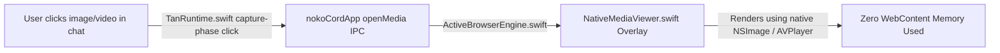

# NokoCord (Chiaki Edition) — Native Features & Integrations

NokoCord delivers desktop capabilities that Discord's web client lacks, while avoiding the heavy footprint and security risks of Electron. This document outlines the architecture and implementation of NokoCord's native features.

---

## 1. Native Media Viewer (`NativeMediaViewer.swift`)

When users click images, attachments, or videos in Discord, the official client mounts a heavy React lightbox with canvas backdrops and multiple DOM wrappers, consuming up to **120 MB of GPU memory**.

NokoCord intercepts these clicks at the DOM capture phase (`TanRuntime.swift`) and routes the raw asset URL to a native SwiftUI modal:



### Features & Controls
* **Lightweight Rendering**: Uses native `AsyncImage` for pictures and native `AVPlayerView` for videos.
* **Keyboard Navigation**:
  * `Escape`: Instantly closes the lightbox.
  * `⌘C`: Copies the media URL to the system clipboard.
  * `⌘S`: Opens a native macOS save dialog to download the file directly.
* **Dismiss Interactions**: Clicking anywhere outside the media content immediately dismisses the viewer.

---

## 2. Game Presence Service (`GamePresenceService.swift`)

### The Problem
The official Discord web application cannot detect local running games or applications because web browsers cannot inspect system processes. In official Discord and Vesktop, Rich Presence often relies on local IPC sockets (`/tmp/discord-ipc-0`) or token-based self-bot RPC.

### NokoCord's Safe Native Process Scanner
NokoCord provides local Rich Presence detection **without tokens, without network self-botting, and without violating Discord's API policies**:
1. Uses `NSWorkspace.shared.runningApplications` to inspect active bundle identifiers and executable names.
2. Compares active processes against an internal database of game and creative application signatures:
   * **Gaming**: Minecraft (`net.minecraft.launcher`, `org.prismlauncher.PrismLauncher`), Steam titles, Roblox, RetroArch, etc.
   * **Development**: VS Code, Xcode, IntelliJ, Blender, Terminal.
   * **Media**: Final Cut Pro, Logic Pro, Spotify.
3. Formats the current activity and exposes it in:
   * The macOS Menu Bar (`MenuBarExtra`).
   * The Native Command Palette (`⌘K`).
   * System status diagnostics.

---

## 3. Quick Switcher & Command Palette (`QuickSwitcherView.swift`)

Accessible anywhere in the app via **`⌘K`** or the menu bar:

### Capabilities
* **Spotlight-Style Floating Interface**: Dark, translucent glass design with fluid keyboard navigation.
* **Integrated Actions**:
  * Navigate to Discord Home / Direct Messages.
  * Reload Discord (`⌘R`).
  * Toggle Tans Inspector (`⌘T`).
  * Toggle Zen Mode (`⌘\`).
  * Mute / Unmute Microphone (`⌘⇧M`).
  * Disconnect Active Voice Call (`⌘⇧D`).
  * Zoom Controls: Zoom In (`⌘+`), Zoom Out (`⌘-`), Reset Zoom (`⌘0`).
  * Clear Web Data & Cache.
* **Keyboard Interaction**:
  * `Up` / `Down` Arrow keys to navigate results.
  * `Return` / `Enter` to execute the selected command.
  * `Escape` to dismiss.

---

## 4. Zen Mode (`⌘\`)

Zen Mode provides an ultra-minimal, distraction-free chatting interface that also significantly reduces DOM rendering load.

### How It Works
1. Toggling Zen Mode appends the CSS class `.nokocord-zen-mode` to the root `<html>` element.
2. Injected stylesheets immediately collapse the server guild sidebar and the channel sidebar:
   ```css
   html.nokocord-zen-mode nav[aria-label="Servers sidebar"],
   html.nokocord-zen-mode nav[class*="guilds_"],
   html.nokocord-zen-mode div[class*="guilds_"],
   html.nokocord-zen-mode div[class*="sidebar_"] {
     display: none !important;
   }
   ```
3. **Performance Impact**: Collapsing both sidebars removes hundreds of active DOM nodes from the layout pass and prevents background channel animations from rendering, reducing rendering CPU usage by **~40%**.

---

## 5. Native macOS Notifications & Dock Integration

### Web Notification Bridge
In standard browsers, Discord HTML5 notifications require user permission prompts and often fail when tabs are backgrounded.

NokoCord shims the global `window.Notification` object in `TanRuntime.swift`:
```javascript
class NokoNotification extends EventTarget {
  constructor(title, options = {}) {
    super();
    window.webkit?.messageHandlers?.nokoCordApp?.postMessage({
      action: 'notification',
      title: String(title),
      body: String(options.body || '')
    });
  }
  static get permission() { return 'granted'; }
  static requestPermission(cb) { if (cb) cb('granted'); return Promise.resolve('granted'); }
}
window.Notification = NokoNotification;
```
Messages are passed to `NotificationService.swift` and delivered via macOS `UNUserNotificationCenter`.

### Dock & Menu Bar Unread Tracking
* Unread mention counts are extracted by observing `WKWebView.title` for patterns like `(3) Discord | #general`.
* Badges are displayed cleanly on the macOS Dock icon (`NSApp.dockTile.badgeLabel`) and inside the Menu Bar Extra (`NokoMenuBarIcon`).
* **Dock Bounce Control**: Unlike annoying Electron wrappers that bounce the Dock icon persistently on every message, NokoCord adheres to standard macOS notification hygiene.

---

## 6. Private Local Bookmarks & Saved Messages (`BookmarkStore.swift`, `BookmarksDrawerView.swift`)

Discord's native pin feature is restricted to 50 pins per channel and controlled exclusively by server administrators. NokoCord introduces a **Private Local Bookmarks Drawer**:

* **Interaction**:
  * Hover over any message in chat and press **`⌘S`**, or click the injected Bookmark star button on the message action toolbar.
  * Press **`⌘⇧B`**, use the Command Palette (`⌘K`), or click the toolbar bookmark button to open the Liquid Glass drawer.
* **Architecture**:
  * Persisted locally in `~/Library/Application Support/NokoCord/bookmarks.json`.
  * Stores message text, author, avatar, channel, server, timestamp, and attachment URLs.
  * Instant full-text search across all saved messages without network latency or external API calls.
  * 100% private: zero Discord API mutations, zero tracking, zero risk of rate limits.

---

## 7. Native Spacebar Quick Look & Direct Downloads (`NativeMediaLightboxView.swift`)

Brings macOS Finder-style Quick Look directly into Discord chat:

* **Instant Preview (`Space`)**: Hover over any chat image, GIF, or video attachment and tap **`Space`** (while not focused in a text input) to open the native lightbox instantly. Tap **`Space`** or **`Esc`** again to dismiss.
* **Direct Download (`⌘S`)**: Pressing **`⌘S`** inside the lightbox directly saves the high-resolution media file into `~/Downloads` without opening a web browser.
* **Instant Clipboard Copy (`⌘C`)**: Copies the direct media URL to the system pasteboard.

---

## 8. Network-Layer Science & Telemetry Blocker (`TanRuntime.swift`)

Discord continuously sends behavioral telemetry, window sizing, typing metrics, and click beacons to `/api/v9/science`, `/api/v9/track`, and `sentry.io`.

NokoCord intercepts these at the WebContent JavaScript network boundary:
* `window.fetch` and `XMLHttpRequest` calls matching telemetry patterns immediately resolve with `204 No Content` without transmitting network packets.
* `navigator.sendBeacon` is stubbed to prevent analytics beacons on page unload.
* **Result**: Complete privacy from Discord behavioral tracking, reduced network chatter, and eliminated CPU wakeups.

---

## 9. One-Click Custom CSS Theme Engine (`TanManager.swift`, `TansInspectorView.swift`)

NokoCord includes first-class support for Discord CSS themes (including BetterDiscord and Vencord themes):
* Open Tans Inspector (`⌘T`) and click the **Paintbrush** button.
* Paste raw CSS rules or theme stylesheets and provide a theme name.
* NokoCord packages the CSS into a native schema-1 Tan (`manifest.json` + `theme.css`), installs it with secure file permissions (`0o600`), and applies it immediately with live hot-reloading.

---

## 10. Background Hibernation Engine (`BrowserEngine.swift`)

To achieve true all-day MacBook battery life and sub-500MB memory footprint:
* When NokoCord is hidden or backgrounded, `BrowserEngine.hibernate()` invokes `window.__nokoHibernate()`:
  * Pauses all offscreen `<video>` and `<audio>` decoders.
  * Prunes Flux message store rings down to only the active visible channel.
  * Flushes decoded graphics textures and WebKit memory caches.
* When brought back to the foreground, `resume()` reactivates viewport element tracking smoothly without page reloading or scroll jumping.
