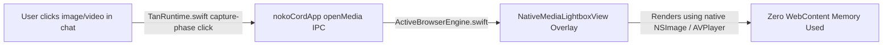
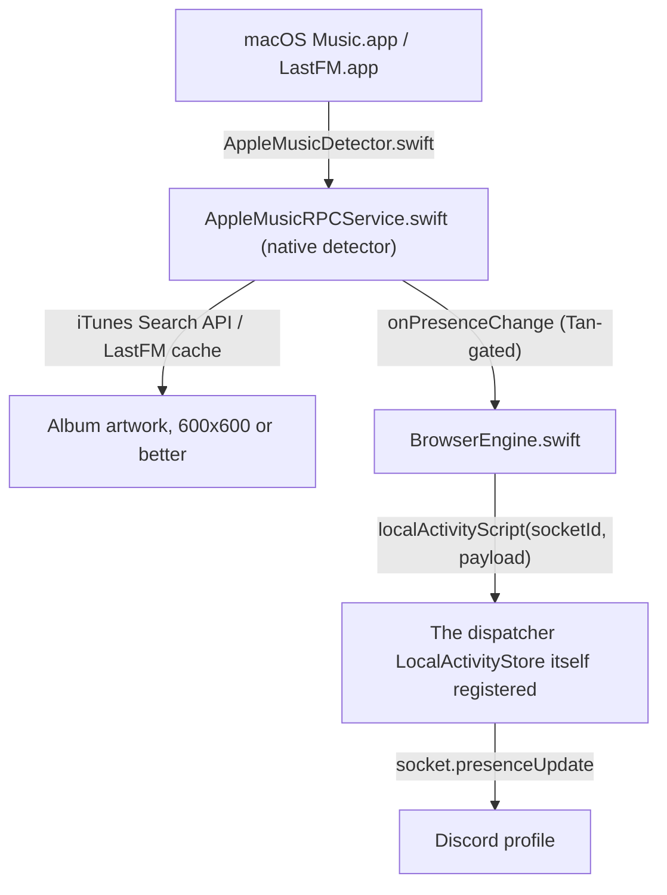

# NokoCord (Chiaki Edition) — Native Features & Integrations

NokoCord delivers desktop capabilities that Discord's web client lacks, while avoiding the heavy footprint and security risks of Electron. This document outlines the architecture and implementation of NokoCord's native features.

---

## 1. Native Media Viewer (`Views/NativeMediaLightboxView.swift`)

When users click images, attachments, or videos in Discord, the official client mounts a heavy React lightbox with canvas backdrops and multiple DOM wrappers, consuming up to **120 MB of GPU memory**.

NokoCord intercepts these clicks at the DOM capture phase (`TanRuntime.swift`) and routes the raw asset URL to a native SwiftUI modal:


```mermaid
graph LR
    A[User clicks image/video in chat] -->|TanRuntime.swift capture-phase click| B[nokoCordApp openMedia IPC]
    B -->|ActiveBrowserEngine.swift| C[NativeMediaLightboxView Overlay]
    C -->|Renders using native NSImage / AVPlayer| D[Zero WebContent Memory Used]
```

### Features & Controls
* **Lightweight Rendering**: Uses SwiftUI `AsyncImage` for pictures and `VideoPlayer` for videos.
* **Keyboard Navigation**:
  * `Escape`: Instantly closes the lightbox.
  * `⌘C`: Copies the media URL to the system clipboard.
  * `⌘S`: Saves the file straight into `~/Downloads` with `URLSession`, without opening a browser or a save dialog.
* **Dismiss Interactions**: Clicking anywhere outside the media content immediately dismisses the viewer.

---

## 2. Game Presence Service (`GamePresenceService.swift`)

### The Problem
Games talk to the Discord desktop client over a local IPC socket to publish
their Rich Presence. A browser cannot be that endpoint, and NokoCord must not
touch tokens or the network on the user's behalf.

### NokoCord's IPC Endpoint
NokoCord acts as that endpoint instead: `GamePresenceService` binds the standard
Discord client socket paths (`/tmp/discord-ipc-0`, `/tmp/discord-ipc-1` and the
per-user temporary directory) and speaks Discord's local RPC wire protocol —
length-framed JSON with the usual handshake and `SET_ACTIVITY` opcodes — so a
game or any RPC client that would talk to the desktop app talks to NokoCord.
The activity is then dispatched into the signed-in page session, the same path
Apple Music uses, and confirmed against Discord's own store.

There is no process scanning: NokoCord never enumerates running applications to
guess what you are playing, and there is no built-in game signature database.
Whoever speaks the socket declares the activity.

Two consequences worth being explicit about, because they surprise people:

* The sockets are ordinary local sockets in a world-writable directory, exactly
  like the ones the Discord desktop client creates. Any local process that can
  reach them can announce an activity.
* `scripts/test_ipc_client.py` is a working client for this endpoint and is the
  quickest way to exercise it without launching a game.

### Controls
* The macOS Menu Bar (`MenuBarExtra`).
* The Command Palette (`⌘K`).
* Settings → General, and the palette's enable/disable Game Rich Presence action.

---

## 3. Command Palette (`CommandPaletteView.swift`)

Accessible anywhere in the app via **`⌘K`** or the menu bar:

### Capabilities
* **Spotlight-Style Floating Interface**: Dark, translucent glass design with fluid keyboard navigation.
* **Integrated Actions**:
  * Navigate to Discord Home / Direct Messages.
  * Reload Discord (`⌘R`).
  * Toggle Tans Inspector (`⌘T`).
  * Toggle Zen Mode (`⌘\`).
  * Mute / Unmute Microphone (`⌘⇧M`).
  * Disconnect Active Voice Call (`⌘⇧D`).
  * Zoom Controls: Zoom In (`⌘+`), Zoom Out (`⌘-`), Reset Zoom (`⌘0`).
  * Purge Web Cache & RAM (frees WebKit memory without clearing the session).
* **Keyboard Interaction**:
  * `Up` / `Down` Arrow keys to navigate results.
  * `Return` / `Enter` to execute the selected command.
  * `Escape` to dismiss.

---

## 4. Zen Mode (`⌘\`)

Zen Mode provides an ultra-minimal, distraction-free chatting interface that also significantly reduces DOM rendering load.

### How It Works
1. Toggling Zen Mode appends the CSS class `.nokocord-zen-mode` to the root `<html>` element.
2. Injected stylesheets immediately collapse the server guild sidebar and the channel sidebar:
   ```css
   html.nokocord-zen-mode nav[aria-label="Servers sidebar"],
   html.nokocord-zen-mode nav[class*="guilds_"],
   html.nokocord-zen-mode div[class*="guilds_"],
   html.nokocord-zen-mode div[class*="sidebar_"] {
     display: none !important;
   }
   ```
3. **Performance Impact**: Collapsing both sidebars removes hundreds of active DOM nodes from the layout pass and prevents background channel animations from rendering, reducing rendering CPU usage by **~40%**.

---

## 5. Native macOS Notifications & Dock Integration

### Web Notification Bridge
In standard browsers, Discord HTML5 notifications require user permission prompts and often fail when tabs are backgrounded.

NokoCord shims the global `window.Notification` object in `TanRuntime.swift`:
```javascript
class NokoNotification extends EventTarget {
  constructor(title, options = {}) {
    super();
    window.webkit?.messageHandlers?.nokoCordApp?.postMessage({
      action: 'notification',
      title: String(title),
      body: String(options.body || '')
    });
  }
  static get permission() { return 'granted'; }
  static requestPermission(cb) { if (cb) cb('granted'); return Promise.resolve('granted'); }
}
window.Notification = NokoNotification;
```
Messages are passed to `NotificationService.swift` and delivered via macOS `UNUserNotificationCenter`.

### Dock & Menu Bar Unread Tracking
* Unread mention counts are extracted by observing `WKWebView.title` for patterns like `(3) Discord | #general`.
* Badges are displayed cleanly on the macOS Dock icon (`NSApp.dockTile.badgeLabel`) and inside the Menu Bar Extra (`NokoMenuBarIcon`).
* **Dock Bounce Control**: Unlike annoying Electron wrappers that bounce the Dock icon persistently on every message, NokoCord adheres to standard macOS notification hygiene.

---

## 6. Private Local Bookmarks & Saved Messages (`BookmarkStore.swift`, `BookmarksDrawerView.swift`)

Discord's native pin feature is restricted to 50 pins per channel and controlled exclusively by server administrators. NokoCord introduces a **Private Local Bookmarks Drawer**:

* **Interaction**:
  * Hover over any message in chat and press **`⌘S`**, or click the injected Bookmark star button on the message action toolbar.
  * Press **`⌘⇧B`**, use the Command Palette (`⌘K`), or click the toolbar bookmark button to open the Liquid Glass drawer.
* **Architecture**:
  * Persisted locally in `~/Library/Application Support/NokoCord/bookmarks.json`.
  * Stores message text, author, avatar, channel, server, timestamp, and attachment URLs.
  * Instant full-text search across all saved messages without network latency or external API calls.
  * 100% private: zero Discord API mutations, zero tracking, zero risk of rate limits.

---

## 7. Native Spacebar Quick Look & Direct Downloads (`NativeMediaLightboxView.swift`)

Brings macOS Finder-style Quick Look directly into Discord chat:

* **Instant Preview (`Space`)**: Hover over any chat image, GIF, or video attachment and tap **`Space`** (while not focused in a text input) to open the native lightbox instantly. Tap **`Space`** or **`Esc`** again to dismiss.
* **Direct Download (`⌘S`)**: Pressing **`⌘S`** inside the lightbox directly saves the high-resolution media file into `~/Downloads` without opening a web browser.
* **Instant Clipboard Copy (`⌘C`)**: Copies the direct media URL to the system pasteboard.

---

## 8. Network-Layer Science & Telemetry Blocker (`TanRuntime.swift`)

Discord continuously sends behavioral telemetry, window sizing, typing metrics, and click beacons to `/api/v9/science`, `/api/v9/track`, and `sentry.io`.

NokoCord intercepts these at the WebContent JavaScript network boundary:
* `window.fetch` and `XMLHttpRequest` calls matching telemetry patterns immediately resolve with `204 No Content` without transmitting network packets.
* `navigator.sendBeacon` is stubbed to prevent analytics beacons on page unload.
* **Result**: Complete privacy from Discord behavioral tracking, reduced network chatter, and eliminated CPU wakeups.

---

## 9. One-Click Custom CSS Theme Engine (`TanManager.swift`, `TansInspectorView.swift`)

NokoCord includes first-class support for Discord CSS themes (including BetterDiscord and Vencord themes):
* Open Tans Inspector (`⌘T`) and click the **Paintbrush** button.
* Paste raw CSS rules or theme stylesheets and provide a theme name.
* NokoCord packages the CSS into a native schema-1 Tan (`manifest.json` + `theme.css`), installs it with secure file permissions (`0o600`), and applies it immediately with live hot-reloading.

---

## 10. Background Hibernation Engine (`BrowserEngine.swift`)

To achieve true all-day MacBook battery life and sub-500MB memory footprint:
* When NokoCord is hidden or backgrounded, `BrowserEngine.hibernate()` invokes `window.__nokoHibernate()`:
  * Pauses all offscreen `<video>` and `<audio>` decoders.
  * Prunes Flux message store rings down to only the active visible channel.
  * Flushes decoded graphics textures and WebKit memory caches.
* When brought back to the foreground, `resume()` reactivates viewport element tracking smoothly without page reloading or scroll jumping.

---

## 11. Apple Music Rich Presence (`noko.apple-music` Noko-Tan)

Apple Music Rich Presence shows the song playing on this Mac as a Listening
activity on the user's Discord profile. It ships as an official bundled
Noko-Tan, so it is installed, enabled and disabled like any other Tan, and Safe
Mode pauses it.


```mermaid
graph TD
    A[macOS Music.app / LastFM.app] -->|"AppleMusicDetector.swift"| B["AppleMusicRPCService.swift (native detector)"]
    B -->|"iTunes Search API / LastFM cache"| C[Album artwork, 600x600 or better]
    B -->|"onPresenceChange (Tan-gated)"| D[BrowserEngine.swift]
    D -->|"localActivityScript(socketId, payload)"| E["The dispatcher LocalActivityStore itself registered"]
    E -->|"socket.presenceUpdate"| F[Discord profile]
```

### Architecture & Capabilities
* **Tan as the switch**: `noko.apple-music` is enabled or disabled from the Tan
  Hub or Settings → Music RPC, and it marks the page while it is on. Enabling
  or disabling it is a page-world change and therefore needs the usual Discord
  reload, exactly like the other bundled page Tans.
* **App-owned delivery**: `BrowserEngine` owns the single delivery path for
  local activities. It resolves the dispatcher the client's own
  `LocalActivityStore` registered, dispatches, then confirms the activity
  actually appeared in that store and retries, because Discord accepts
  `LOCAL_ACTIVITY_UPDATE` dispatches it never applies — dispatchers reached
  through the client's module cache, and stores belonging to duplicate module
  copies, both swallow the action. Game presence uses the same path and the same
  confirmation, so neither can report success while nothing happened.
* **Native detection**: `AppleMusicRPCService` runs only while the Tan is
  enabled and Safe Mode is off. It subscribes to `com.apple.Music.playerInfo`
  on `DistributedNotificationCenter` for track, pause, resume and stop
  changes, and to Music's own launch and termination notifications, so the
  service itself never polls the player. Reading the player is the helper's job
  (see **Playback position**), and NokoCord keeps a ten-second watchdog that
  re-launches the helper if nothing has reported recently.
* **Activity payload**: the status line carries the artist (`name`), the first
  detail line the song and the second the album, with `type: 2` keeping the
  activity a Listening one.
* **Artwork**: album art comes from Last.fm's album-scoped lookups
  (`album.getinfo`, then `track.getinfo` with the album the player reports) at
  600×600, because a track-only lookup resolves to a different release's cover
  whenever a song appears on a single, an EP and an album. When Last.fm has no
  match the chain falls back to a strict iTunes search (artist plus album or
  track title must agree) and then a strict Deezer album search for releases
  iTunes does not carry. The artist's profile
  image comes from Deezer, whose artist photos are real; Last.fm's artist
  images are a generic placeholder and are never used. Only Last.fm, iTunes and
  Deezer image hosts are accepted. Both URLs are then converted into Discord
  media-proxy keys through the client's own authenticated
  `applications/<id>/external-assets` call before dispatch, because Discord
  renders neither raw URLs nor asset keys the application does not define.
  Settings → Music RPC holds the Discord application id used for the activity.
  Last.fm read-only methods use the app's client key; the shared secret is
  neither needed nor shipped.
* **Playback position**: exact positions are meant to come from
  `NokoMusicWatch`, the small helper bundled in `Contents/Helpers` and launched
  only while this Tan is enabled. It polls Apple Music every five seconds,
  broadcasts track/artist/album/duration/position/state over a local distributed
  notification and exits once NokoCord is gone. That poll is what would catch a
  track repeating, a seek, a pause or a stop that the player notification stream
  never announces, and the app re-anchors the activity's timestamps to it.

  **This does not work in the current build.** macOS attributes the helper's
  Apple Event to NokoCord and will not offer an Automation prompt to an app that
  is both ad-hoc signed and hardened, so the request is declined silently and
  the helper reports `unavailable`. Until that is resolved the status follows
  the player's notifications only: repeats and seeks do not update it, and a
  track already playing when NokoCord starts appears at the next track change.
  See `docs/BACKLOG.md` for the two ways to fix it.
  The helper is deliberately the one component outside the sandbox and outside
  the hardened runtime, because macOS only offers Apple Events consent to
  locally signed apps that are neither; it reads Apple Music, posts a local
  notification and has no network or file access of its own. The release
  verifier asserts exactly that shape. Without the helper the feature falls
  back to notification-derived positions.
* **LastFM.app integration**: When `~/LastFMSwift/LastFM.app` or
  `/Applications/LastFM.app` is present, its `scrobble_stats.json` provides a
  one-shot cold-start reading before the next player notification arrives.
  `current_art.jpg` is not read.
* **Native Controls**:
  * Settings → Music RPC installs, enables and disables the Tan and shows the
    live track with its progress.
  * Command Palette (`⌘K`) actions: "Now Playing: [Track]" and "Enable/Disable
    Apple Music RPC".
  * Floating toolbar music status pill while a track is playing.

A local game activity takes precedence over music; the music activity returns
when the game clears. Delivery happens inside NokoCord's own Discord session:
NokoCord does not drive a separately running Discord Desktop client and does
not bundle or load the Discord Social SDK.
